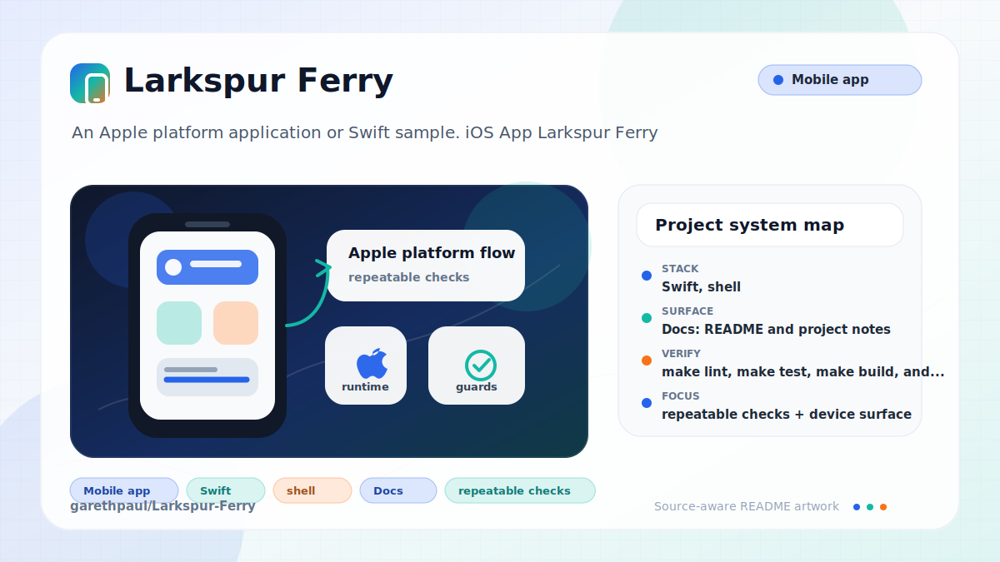

# Larkspur-Ferry

<!-- README-OVERVIEW-IMAGE -->


## Overview

`garethpaul/Larkspur-Ferry` is an Apple platform application or Swift sample. iOS App Larkspur Ferry

This README is based on the checked-in source, manifests, scripts, and repository metadata on the `master` branch. The project language mix found during review was: Swift (10), shell (1).

## Repository Contents

- `CHANGES.md` - recent maintenance changes
- `Makefile` - local static verification entry point
- `README.md` - project overview and local usage notes
- `Podfile` - Apple platform dependency metadata
- `build.sh`
- `Larkspur Ferry` - source or example code
- `Larkspur Ferry.xcodeproj` - Xcode project file
- `Larkspur FerryUITests` - source or example code
- `Podfile.lock` - Apple platform dependency metadata
- `scripts/check-baseline.py` - static Swift/API/location baseline checks
- `SECURITY.md` - security reporting and disclosure guidance
- `VISION.md` - project direction and maintenance guardrails

Additional scan context:

- Source directories: Larkspur Ferry, Larkspur FerryUITests
- Dependency and build manifests: Podfile, Podfile.lock
- Entry points or build surfaces: `make lint`, `make test`, `make build`, `make check`, build.sh, Larkspur Ferry.xcodeproj
- Test-looking files: Larkspur FerryUITests/Info.plist, Larkspur FerryUITests/Larkspur_FerryUITests.swift, Larkspur FerryUITests/SnapshotHelper.swift

## Getting Started

### Prerequisites

- Git
- Python 3 for static verification with `make lint`, `make test`, `make build`, and `make check`
- macOS with Xcode for building Apple platform projects
- CocoaPods if dependencies need to be installed

### Setup

```bash
git clone https://github.com/garethpaul/Larkspur-Ferry.git
cd Larkspur-Ferry
make lint
make test
make build
make check
pod install
```

The setup commands above are derived from repository files. Legacy mobile, Python, or JavaScript samples may require older SDKs or package versions than a modern workstation uses by default.

## Running or Using the Project

- Open `Larkspur Ferry.xcworkspace` in Xcode after `pod install`, choose the app or sample scheme, and run it on the matching simulator/device.
- Run `./build.sh` when the required platform toolchain is installed.
- `build.sh` skips cleanly on hosts without CocoaPods or Xcode so static checks can run on non-macOS machines.
- The map refresh timer starts while the map screen is visible and is invalidated when the screen disappears.
- An in-flight map response is discarded after the map screen disappears, so
  retained off-screen controllers do not recenter or replace annotations.
- Ferry annotation refresh removes stale ferry pins without clearing unrelated map annotations.
- Failed map-location refresh responses keep the last known ferry pin until a
  successful refresh can replace it.
- The initial direction lookup is a single-shot location flow; unavailable, empty, or failed CoreLocation/geocoder data stops location updates before falling back to schedule loading.
- API request parameters use deterministic query ordering after percent encoding.
- Ferry API latitude and longitude strings use locale-independent coordinate parsing.
- Schedule table times use POSIX schedule time parsing for fixed-format ferry API values.
- Live ferry requests bypass cached data, time out after 10 seconds, and accept
  only successful `application/json` responses before parsing.
- Schedule table and map API callbacks use main-thread UI updates before
  mutating UIKit or MapKit state.
- A stale schedule response is ignored after the user selects the opposite
  ferry direction.
- A stale geocoder completion is ignored after any newer manual direction
  change, including tap-away-and-back sequences.

## Testing and Verification

- `make lint`, `make test`, `make build`, and `make check` run `scripts/check-baseline.py` and the guarded `build.sh` path. The checker verifies build-script syntax, plist/storyboard/asset parsing, Podfile lock metadata, API parsing guardrails, deterministic query parameter encoding, locale-independent coordinate parsing, POSIX schedule time parsing, main-thread UI updates, stale schedule response rejection, single-shot location fallbacks, map refresh timer lifecycle handling, ferry annotation refresh handling, failed map-location refresh handling, and generated metadata ignores.
- The Make gates are location-independent. From another directory, pass the
  checkout's Makefile by absolute path, such as
  `make -f /path/to/Larkspur-Ferry/Makefile check`.
- The `lint`, `test`, and `build` targets intentionally alias the existing
  check path so the standard local gate commands stay available while preserving
  the guarded CocoaPods/Xcode skip behavior on hosts without that toolchain.
- Pinned, credential-free `macos-15` GitHub Actions runs `make check` with
  `SKIP_XCODE_BUILD=1` and parses `Larkspur Ferry.xcodeproj` using
  `xcodebuild -list`. This hosted validation does not install pods, call the
  ferry API, request location, build or sign the app, run a simulator, or
  execute UI tests. Checkout credentials are not persisted after source
  retrieval.
- Xcode's test action or `xcodebuild test` with the appropriate scheme and destination

When the required SDK or runtime is unavailable, use static checks and source review first, then verify on a machine that has the matching platform toolchain.

## Configuration and Secrets

- The app uses the documented HTTPS ferry API endpoint in `Larkspur Ferry/API.swift`.
- Keep API credentials, signing files, local CocoaPods output, and generated app data out of git if any are introduced later.
- Location is requested only for in-app ferry direction assistance and should fall back to schedule loading when unavailable.
- Location-derived direction state must update the canonical schedule origin
  before direction images or a schedule request are published.

## Security and Privacy Notes

- Review changes touching external API calls or credential-adjacent configuration; examples from the scan include Larkspur Ferry/Info.plist.
- Review changes touching network requests, sockets, or service endpoints; examples from the scan include Larkspur Ferry/API.swift, Larkspur Ferry/Extensions.swift, Larkspur Ferry/Info.plist, Larkspur FerryUITests/Info.plist, and 2 more.
- Review changes touching mobile permissions or privacy-sensitive device data; examples from the scan include Larkspur Ferry/API.swift, Larkspur Ferry/MapViewController.swift, Larkspur Ferry/ViewController.swift.
- Do not add force-unwrapped API payloads, force-unwrapped location data, or app debug logging for transit/location failures.
- Review changes touching file, media, JSON, XML, CSV, OCR, or data parsing; examples from the scan include Larkspur Ferry/API.swift, Larkspur Ferry/Info.plist, Larkspur Ferry/MapViewController.swift, Larkspur Ferry/ViewController.swift, and 1 more.

## Maintenance Notes

- This looks like an Apple platform project or sample. Xcode, Swift, CocoaPods, and deployment target versions may need to match the original project era.
- Run `make lint`, `make test`, `make build`, and `make check` before pushing Swift, build-script, Podfile, storyboard, plist, asset, or security documentation changes.
- Use an absolute Makefile path when running those gates outside the checkout.
- See `SECURITY.md` for vulnerability reporting and safe research guidance.
- See `VISION.md` for project direction and contribution guardrails.
- See `docs/plans/2026-06-09-make-gate-aliases.md` for the local gate alias guardrail.
- See `docs/plans/2026-06-09-main-thread-ui-updates.md` for schedule and map UI callback handling.
- See `docs/plans/2026-06-10-map-refresh-failure-preserves-pin.md` for failed
  map-location refresh handling.

## Contributing

Keep changes small and tied to the project that is already present in this repository. For code changes, document the toolchain used, avoid committing generated dependency directories or local configuration, and update this README when setup or verification steps change.
